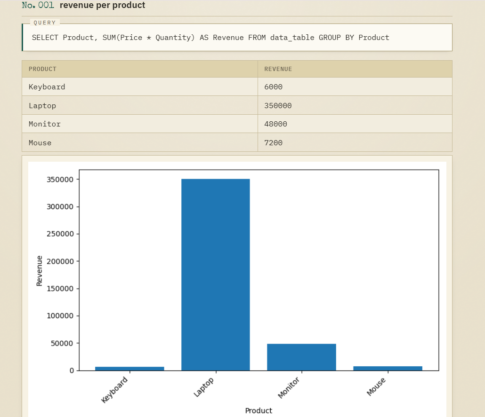

# InsightAI — Ask your data questions in plain English

Upload a CSV, ask a question in plain English (e.g. "Which product sold the most?"),
and InsightAI converts it to SQL, runs it safely, and shows you the answer — with
an auto-generated chart when the result has multiple rows.

## Live Demo

**[Try InsightAI live →](https://insightai-4lor.onrender.com)**

*Hosted on Render's free tier — the first request after inactivity may take 30–50 seconds to wake up.*



*Example: asking "revenue per product" — Gemini generates the SQL, InsightAI validates and runs it read-only, and auto-generates a chart.*

## How it works

1. **CSV → SQLite** — `load_csv_to_sqlite()` reads the uploaded CSV with pandas and loads it into a local SQLite table, building a schema string describing each column and its type.
2. **Question → SQL** — Your question and the schema are sent to Gemini (`gemini-flash-latest`) with a prompt instructing it to return ONLY a raw SQL query, SELECT-only, no markdown.
3. **Safety layer** — Before anything runs, the generated SQL is validated in code: it must be a single `SELECT` statement, with no chained statements and no destructive keywords (`DROP`, `DELETE`, `INSERT`, `ALTER`, etc.), even if they're hidden inside the query. The database connection itself is also opened in **read-only mode** as a second, independent layer of protection — the app never trusts model output blindly.
4. **Execution** — The validated query runs against SQLite via `pandas.read_sql_query`.
5. **Chart generation** — If the result has 2+ rows and both a label column and a numeric column, a bar chart is generated with Matplotlib and returned alongside the table. Single-value results skip charting automatically.

## Project structure

- `app.py` — Flask app: routes for upload, ask, and serving charts
- `templates/index.html` — frontend UI
- `insightai.py` — the original CLI version (still works standalone, see below)
- `sales.csv` — sample dataset for testing
- `requirements.txt` — dependencies for deployment

## Run it locally

1. Install dependencies:
   ```
   pip install -r requirements.txt
   ```

2. Get a free Gemini API key: https://aistudio.google.com/apikey

3. Set it as an environment variable:

   **Windows (PowerShell):**
   ```
   $env:GEMINI_API_KEY="your-key-here"
   ```

   **Mac/Linux:**
   ```
   export GEMINI_API_KEY="your-key-here"
   ```

4. Run the web app:
   ```
   python app.py
   ```

5. Open `http://127.0.0.1:5000` in your browser, upload `sales.csv`, and ask a question.

## Run the original CLI version

The original command-line version still works standalone:

```
python insightai.py sales.csv
```

Then ask questions like:
- "Which product sold the most?"
- "Total revenue per month"
- "Who is the top customer by spend?"

Type `exit` to quit.

## Tech stack

Python, Flask, pandas, SQLite, Matplotlib, Google Gemini API (`google-genai`), deployed on Render.

## Notes

- Built incrementally: started as a CLI tool to prove out the core pipeline
  (CSV → SQL generation → execution → charting), then wrapped in Flask with a
  frontend and deployed live.
- SQL generated by the LLM is never trusted or executed blindly — every query
  passes through code-level validation and runs against a read-only database
  connection before any result is returned.
