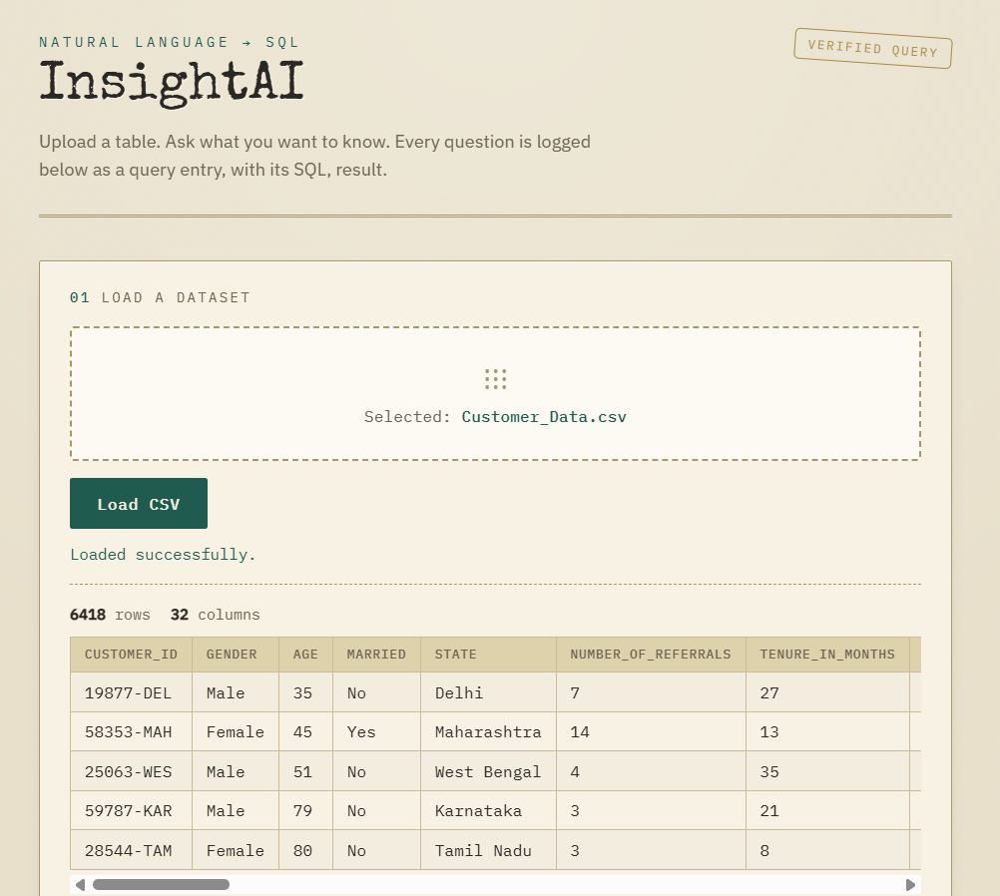
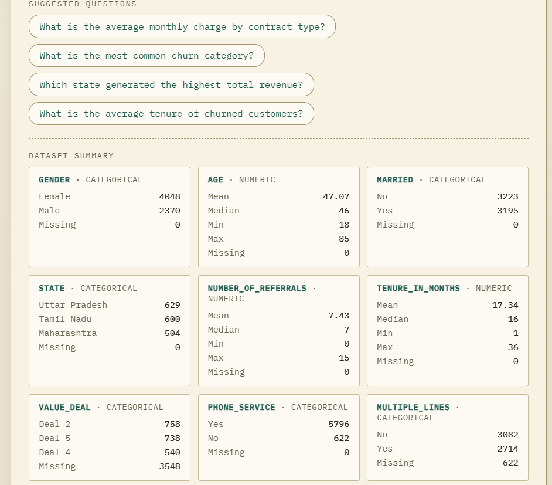
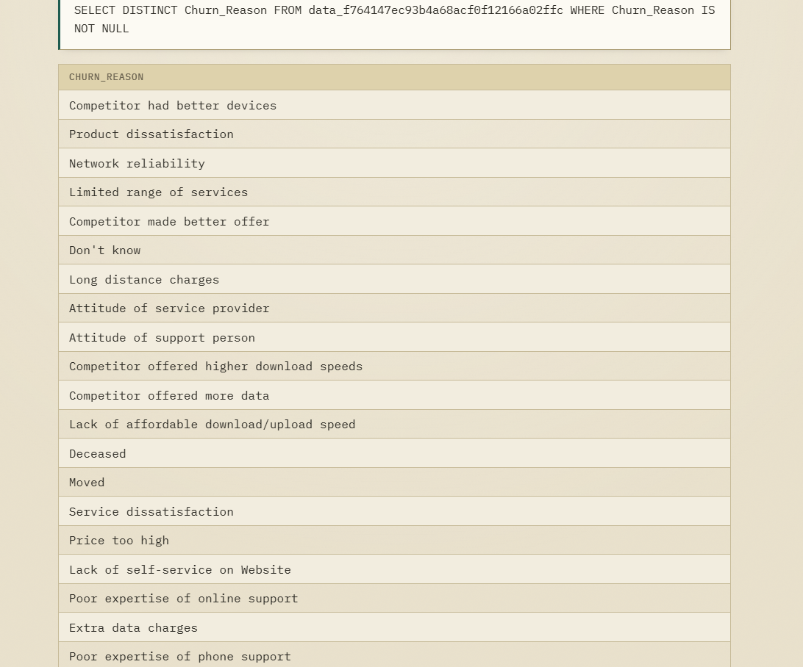

# InsightAI — Ask Your Data Questions in Plain English

InsightAI is an AI-assisted analytics platform that allows users to upload a structured CSV dataset and ask analytical questions in plain English instead of manually writing SQL.

For example, a user can upload a customer dataset and ask:

> "What are the reasons for churn?"

InsightAI uses the uploaded dataset schema to generate SQL, validates the query, executes it safely against SQLite, and presents the result along with a plain-English explanation of the SQL and a short Analyst's Note.

The project is designed as a practical analytics workflow combining **Python, SQL, data profiling, AI-assisted querying, and business interpretation**.

---

## Live Demo

[**Try InsightAI Live →**](https://insightai-4lor.onrender.com/)

*Hosted on Render's free tier — the first request after inactivity may take some time to wake up.*

---

## Screenshots

### 1. Upload & Dataset Preview

Users can upload a CSV file using the drag-and-drop interface or file browser.

After loading the dataset, InsightAI displays the row count, column count, and a preview of the uploaded data.



---

### 2. Suggested Questions & Automated EDA Summary

After upload, InsightAI generates dataset-specific analytical questions and an automated dataset summary.

The EDA summary provides:

- Numeric column statistics such as mean, median, minimum, maximum, and missing values
- Categorical column top values and counts
- Column data types



---

### 3. Natural Language Question

Users can ask analytical questions in plain English instead of manually writing SQL.

Example:

> "What are the reasons of churn?"


---

### 4. Generated SQL & Query Result

InsightAI converts the natural-language question into SQL, validates the query, executes it against the uploaded dataset, and displays the resulting data.



---

### 5. Analyst's Note

InsightAI generates a short business interpretation of the query result instead of showing only raw numbers.

This helps connect technical query output with a business-oriented analytical observation.


---

### 6. Session History

Every question asked during the current browser session is stored in Session History.

Selecting an earlier question restores its saved interaction in the main result area.


---

## Features

- **Natural Language → SQL** — ask questions in plain English and receive a validated, read-only SQL query and its result.
- **Session-based dataset handling** — the uploaded dataset and query state are associated with the current user session.
- **Dataset profiling on upload** — row count, column count, and a live dataset preview are shown immediately after upload.
- **Automated EDA summary** — numeric and categorical columns are summarized automatically with useful statistics, value counts, column types, and missing-value counts.
- **Suggested questions** — dataset-specific analytical questions are generated from the uploaded schema and displayed as clickable chips.
- **SQL validation and read-only execution** — generated SQL is checked before execution and destructive database operations are blocked.
- **SQL explanation** — a plain-English explanation helps users understand what the generated SQL does.
- **Analyst's Note** — a short business interpretation is generated from the query result.
- **CSV export** — users can download query results as a CSV file directly from the browser.
- **Error recovery** — temporary Gemini/API failures are retried before an error is shown to the user.
- **Session history** — previous questions can be selected and their saved interactions restored in the main result area.

---

## How It Works

### 1. CSV → SQLite

The uploaded CSV is read using **Pandas** and loaded into **SQLite**.

InsightAI also extracts the dataset schema, including column names and data types, which is later used for SQL generation.

---

### 2. Dataset Profiling

After upload, InsightAI provides an initial view of the dataset including:

- Row count
- Column count
- Dataset preview
- Numeric column statistics
- Categorical top values and counts
- Column data types
- Missing-value counts

This gives the user an initial understanding of the dataset before asking analytical questions.

---

### 3. Suggested Questions

InsightAI uses the dataset schema to generate short analytical questions that can be answered using the uploaded table.

These questions are displayed as clickable chips and can be sent directly to the query interface.

---

### 4. Question → SQL

The user's natural-language question and the dataset schema are sent to Gemini.

The model is instructed to generate SQL for the uploaded dataset.

---

### 5. SQL Safety Layer

The generated SQL is not executed blindly.

InsightAI validates the query before execution.

The validation layer checks that:

- The query is a `SELECT` statement.
- Only a single SQL statement is used.
- Destructive SQL operations are blocked.
- The query refers to the expected uploaded dataset table.

The database connection is also opened in **read-only mode** during query execution.

---

### 6. Query Execution

After validation, the SQL query is executed against the uploaded dataset using SQLite and Pandas.

The resulting columns and rows are returned to the frontend and displayed as a result table.

---

### 7. Result, SQL Explanation & Analyst's Note

The query result is displayed in the interface along with:

- Generated SQL
- Plain-English SQL explanation
- Short Analyst's Note

This helps bridge the gap between technical SQL output and business understanding.

---

### 8. Session History

Each question and its complete response are stored in browser memory during the current session.

Users can select a previous question from Session History to restore that interaction in the main result area.

Refreshing the page clears the browser-side session history.

---

## Business Analyst Workflow

InsightAI is designed around a practical analytics workflow that helps users explore structured data without manually writing every SQL query.

```text
Upload Dataset
      ↓
Dataset Preview
      ↓
Automated EDA Summary
      ↓
Suggested Analytical Questions
      ↓
Ask Question in Plain English
      ↓
AI-Generated SQL
      ↓
SQL Validation
      ↓
Read-Only Query Execution
      ↓
Result Table
      ↓
SQL Explanation
      ↓
Analyst's Note
      ↓
Session History
