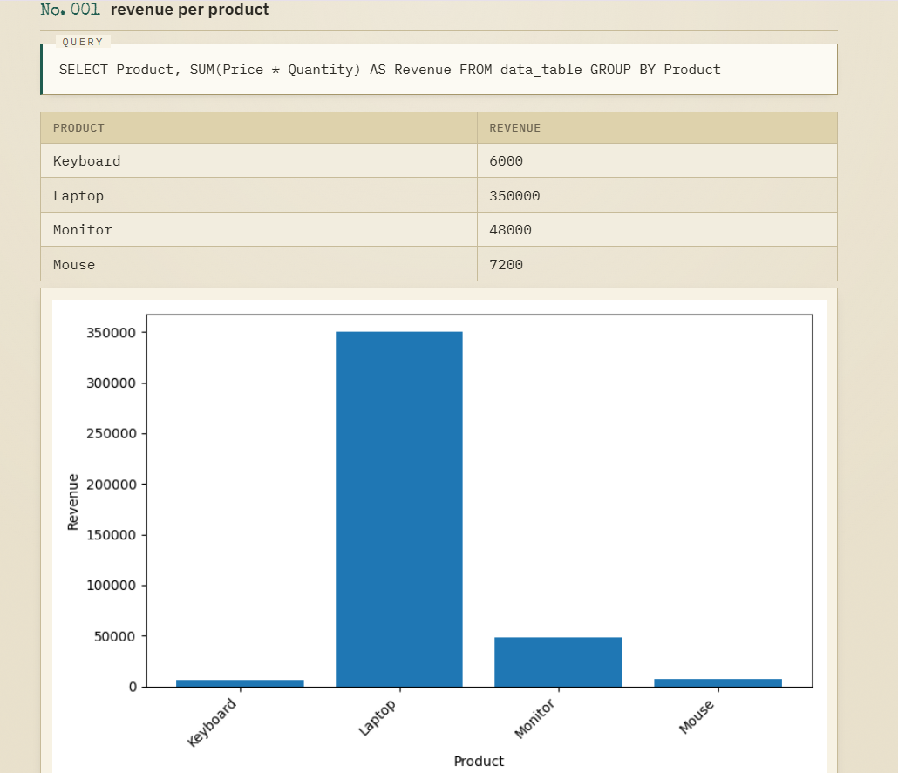

# InsightAI — Ask your data questions in plain English

Upload a CSV, ask a question in plain English (e.g. "Which product generated the most revenue?"), and InsightAI converts it to SQL, runs it safely, and shows you the answer — with an auto-generated chart, a plain-English explanation of the SQL, and a one-line business insight, all in one place.

## Live Demo

**[Try InsightAI live →](https://insightai-4lor.onrender.com)**

*Hosted on Render's free tier — the first request after inactivity may take 30–50 seconds to wake up.*



*Example: uploading a customer dataset, then asking a question — InsightAI shows the generated SQL with a plain-English explanation, the result table, a chart, and an AI-generated analyst's note.*

## Features

- **Natural language → SQL** — ask a question in plain English, get a validated, read-only SQL query and its result.
- **Multi-user session isolation** — each visitor gets their own dataset, table, and chart namespace, so two people using the live app at once never see each other's data.
- **Dataset profiling on upload** — row count, column count, and a live preview shown immediately after upload.
- **Automated EDA summary** — for every column, shown automatically after upload: mean/median/min/max for numeric columns, top values for categorical columns, and a missing-value count for each, so the dataset is understood before any question is asked.
- **Suggested questions** — 3–4 example questions generated from the dataset's own schema, shown as clickable chips.
- **SQL explanation** — a one-sentence, plain-English explanation of what the generated SQL actually does.
- **Analyst's note** — a one-sentence business interpretation of the result (e.g. "the East region has the lowest revenue"), not just raw numbers.
- **Chart generation** — results with a label column and a numeric column are auto-charted; single-value answers skip charting since there's nothing to plot.
- **CSV export** — download any result as a CSV file directly from the browser.
- **Automatic retry on transient errors** — if SQL generation fails or Gemini is temporarily overloaded, InsightAI retries once with the failure reason before showing an error.
- **Session history** — every question asked in the session is logged; clicking a past entry restores its full answer (SQL, table, chart, explanation, and insight) in the main view.

## How it works

1. **CSV → SQLite** — `load_csv_to_sqlite()` reads the uploaded CSV with pandas and loads it into a session-specific SQLite table, building a schema string describing each column and its type.
2. **Question → SQL** — the question and schema are sent to Gemini (`gemini-flash-latest`) with a prompt instructing it to return ONLY a raw SQL query, SELECT-only, no markdown. If the first attempt fails, it's retried once with the failure reason included, so the model can self-correct.
3. **Safety layer** — before anything runs, the generated SQL is validated in code: it must be a single `SELECT` statement, with no chained statements, no destructive keywords (`DROP`, `DELETE`, `INSERT`, `ALTER`, etc.) even if hidden inside the query, and it must reference only the caller's own session table — never another visitor's data. The database connection itself is also opened in **read-only mode** as a second, independent layer of protection.
4. **Execution** — the validated query runs against SQLite via `pandas.read_sql_query`.
5. **Chart generation** — if the result has 2+ rows and both a label column and a numeric column, a bar chart is generated with Matplotlib. Single-value results skip charting automatically.
6. **Insight + explanation** — the result is sent back to Gemini for a one-sentence business interpretation, and the generated SQL is sent separately for a one-sentence plain-English explanation. Both are optional additions — if either call fails, the core result is still shown.

## Project structure

- `app.py` — Flask app: routes for upload, ask, and serving charts; session handling, SQL safety validation, and all Gemini calls (SQL generation, insight, explanation, suggested questions)
- `templates/index.html` — frontend UI (upload, question box, dataset summary, suggested questions, session history, result display)
- `insightai.py` — the original CLI version (still works standalone, see below)
- `sales.csv` — sample dataset for testing
- `requirements.txt` — dependencies for deployment

## Run it locally

1. Install dependencies:
```
pip install -r requirements.txt
```

2. Get a free Gemini API key: <https://aistudio.google.com/apikey>

3. Set it as an environment variable:

   **Windows (PowerShell):**
   ```
   $env:GEMINI_API_KEY="your-key-here"
   ```

   **Mac/Linux:**
   ```
   export GEMINI_API_KEY="your-key-here"
   ```

4. Run the web app:
```
python app.py
```

5. Open `http://127.0.0.1:5000` in your browser, upload `sales.csv`, and ask a question.

## Run the original CLI version

The original command-line version still works standalone:
```
python insightai.py sales.csv
```

Then ask questions like:
- "Which product sold the most?"
- "Total revenue per month"
- "Who is the top customer by spend?"

Type `exit` to quit.

## Tech stack

Python, Flask, pandas, SQLite, Matplotlib, Google Gemini API (`google-genai`), deployed on Render.

## Notes

- Built incrementally: started as a CLI tool to prove out the core pipeline (CSV → SQL generation → execution → charting), then wrapped in Flask with a frontend and deployed live, then extended with dataset profiling, suggested questions, business insights, SQL explanations, CSV export, retry-based error recovery, and session history.
- SQL generated by the LLM is never trusted or executed blindly — every query passes through code-level validation and runs against a read-only database connection, scoped to the caller's own session, before any result is returned.
- Session history lives in the browser for the current session only; refreshing the page clears it.
